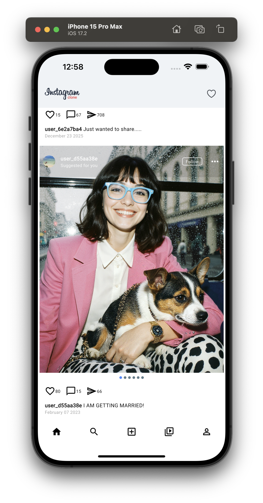
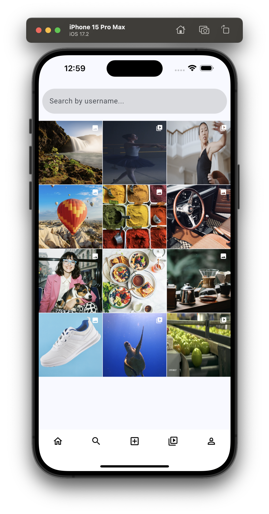
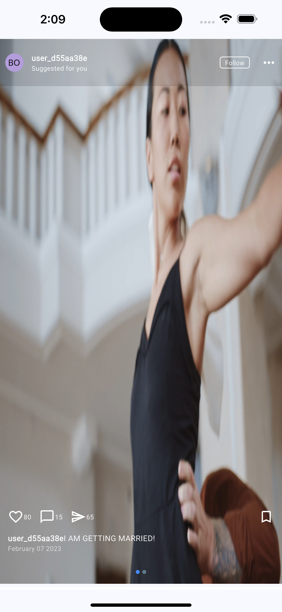
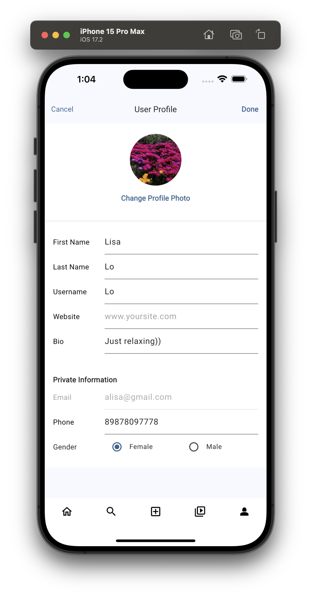
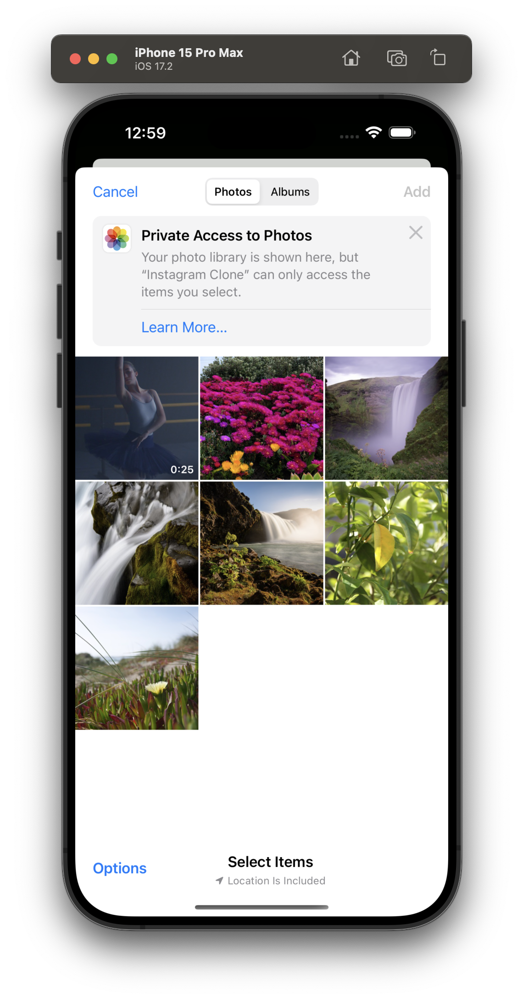
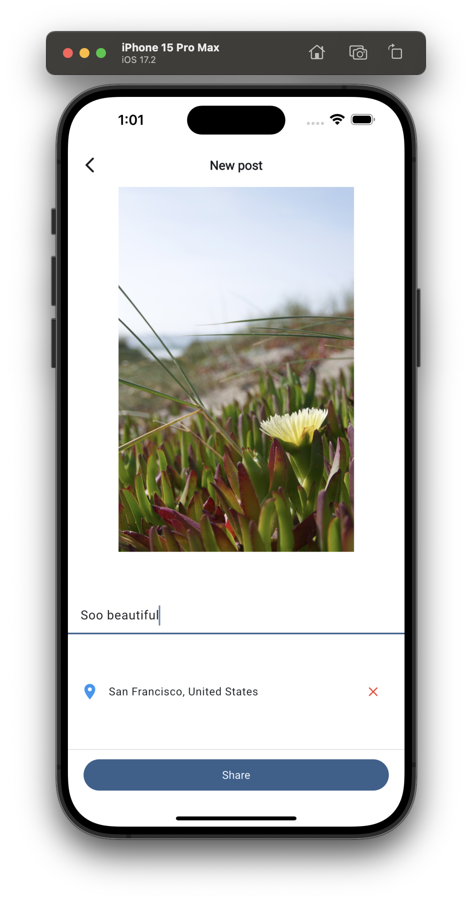
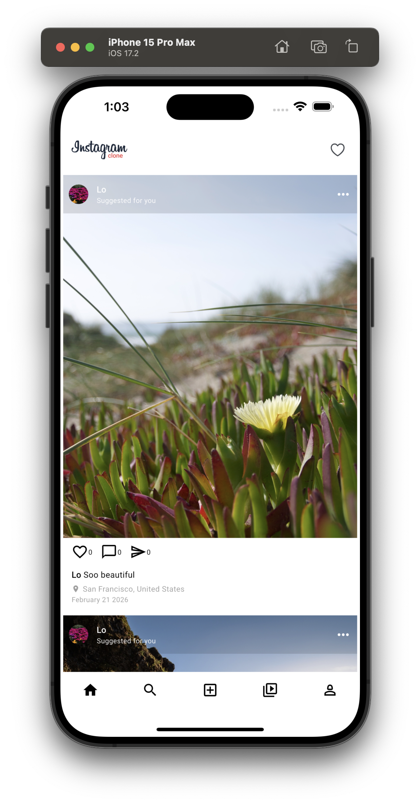

# insta-clone-flutter
 
Full-featured Instagram clone built with Flutter and Firebase. Created as part of a year-long Flutter development program with additional self-implemented features like geolocation.
 
[](https://flutter.dev)
[](https://dart.dev)
[](https://firebase.google.com)
[](LICENSE)
 
---
 
## 🚀 Key Features
 
- **User Authentication** (Firebase Auth)
- **Post Feed** with photos and videos
- **Create Posts** with media content
- **📍 Geolocation** – added independently (determines location, converts to address, saves to Firestore, displays in feed)
- **User Profiles** with follow system
- **Likes, Comments, Shares**
- **Firebase Firestore & Storage** for data and media
- **Video Player** for video posts
- **Carousel Slider** for multi-image posts
 
---
 
## 📸 Screenshots
 
### Main Screens
| Feed | Search | Video | Profile |
|------|--------|-------|---------|
|  |  |  |  |
 
### Creating a Post
| Step 1: Pick photo | Step 2: Add caption & location | Step 3: Post published |
|--------------------|-------------------------------|------------------------|
|  |  |  |
 
---
 
## 🛠️ Tech Stack
 
- **Flutter 3.0+**, **Dart 3.0+**
- **Firebase** (Authentication, Firestore, Storage)
- **Geolocation API** (`geolocator` + `geocoding` packages)
- **Cloudinary** for media optimization
- **Provider** for state management
- **Additional Packages**: `video_player`, `image_picker`, `carousel_slider`, `intl`, `timeago`, and more.
 
---
 
## 📱 Getting Started
 
### Prerequisites
- Flutter SDK 3.0+ ([install guide](https://flutter.dev/docs/get-started/install))
- Android Studio / VS Code
- Firebase account
 
### Installation
 
1. **Clone the repository**
   ```bash
   git clone https://github.com/maria-popova-dev/insta-clone-flutter.git
   cd insta-clone-flutter
```

1. Install dependencies
   ```bash
   flutter pub get
   ```
2. Firebase Setup
   · Create a new project in Firebase Console.
   · Add Android and iOS apps to your Firebase project.
   · Download configuration files:
   · google-services.json → place in android/app/
   · GoogleService-Info.plist → place in ios/Runner/
   · Enable Authentication (Email/Password, Google Sign-In, etc.).
   · Set up Firestore Database and Storage (start in test mode for development).
3. Run the app
   ```bash
   flutter run
   ```

---

📁 Project Structure

```
lib/
├── main.dart
├── screens/           # App screens
├── posts/             # Post logic (models, services)
├── user-profile/      # User profiles
├── home/              # Feed and media
├── services/          # Business logic
│   └── location_service.dart  # Geolocation service
├── app.components/    # Reusable UI components
└── util/              # Helper utilities
```
 
---

🎯 What I Learned

· Full mobile app development cycle
· Firebase integration (Auth, Firestore, Storage)
· State management with Provider
· Working with native APIs (geolocation)
· Platform-specific configuration (iOS/Android)
· Git version control and collaboration
· Project documentation and presentation
 
---

👩‍💻 About Me

Maria Popova
Flutter Developer | Year-Long Program Graduate

· Passionate about creating amazing mobile experiences
· Constantly learning and exploring new technologies
· Open to collaboration and opportunities

Contact:
📧 maria.popova.dev@outlook.com
🐙 GitHub: maria-popova-dev
 
---

📄 License

This project is licensed under the MIT License – see the LICENSE file for details.

Note: This project is created for educational purposes as part of a Flutter development course. It is not intended for commercial use and is not affiliated with Instagram or Meta.
 
---

> *"The journey of a thousand miles begins with a single step."* 
> — Это репозиторий — мой первый шаг в долгом пути Flutter-разработчика. С него всё началось.
---

⭐ If you find this project useful, please consider giving it a star! It helps others discover it.

